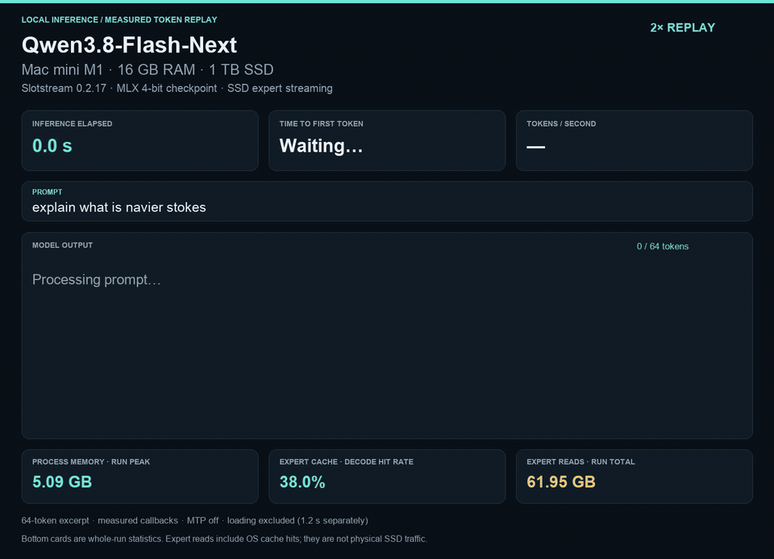

# Qwen3.8-Flash-Next on a 16 GB M1 Mac mini

A reproducible local inference experiment using **Slotstream 0.2.17** to stream
Qwen3.8-Flash-Next experts from SSD. This recipe uses the existing upstream
runtime; it does not claim authorship of Slotstream or its model implementation.

## Measured result



[Download the MP4](assets/demo.mp4) · [Final frame](assets/demo.png) ·
[Native statistics](benchmarks/navier64-stats.json) · [Token timeline](benchmarks/navier64-replay.json)

Prompt: `explain what is navier stokes` (19 tokens including the chat template).
The demo is a **64-token excerpt**, stopped at the requested limit, not a complete answer.

| Measurement | Recorded run |
| --- | ---: |
| Time to first token, excluding loading | 4.96 s |
| Mean interval after first token | 0.569 s/token |
| Throughput from those intervals | 1.76 tokens/s |
| Inference through the last displayed token | 40.77 s |
| Model loading, separately | 1.21 s |
| Peak process physical footprint | 5.09 GB |
| Expert pool | 640 slots / 1.77 GB |

A [second independent process run](benchmarks/navier64-repeat-stats.json) produced
the same 64 token IDs: 4.957 s TTFT, 0.568 s/token, and 5.084 GB peak footprint.

An [arithmetic sanity check](benchmarks/arithmetic-stats.json) also returned `4` for `What is 2+2?` and terminated
normally. These are short local smoke tests, not model-quality validation or a
long-context benchmark. The demo ran after that sanity check, so some file pages
could already be cached by macOS; this is not a controlled cold-cache benchmark.
Closing unused GUI applications was necessary to pass the memory planner.

The previous DeepSeek result was about 23 seconds/token. This Qwen run was much
faster, but uses a different model, quantization, runtime, and workload length.

## Hardware and model

- Apple M1 Mac mini, 16 GB unified memory, internal 1 TB SSD, macOS 26.5.2.
- Qwen3.8-Flash-Next: 125B main-model parameters plus 51B n-gram embedding
  parameters, with 6B active per token, per the Qwen model announcement.
- Slotstream's pinned MLX 4-bit checkpoint, about 105 GB on disk. It is a
  quantized checkpoint, unlike the original native-format DeepSeek experiment.
- Text only, greedy sampling, MTP/speculative decoding disabled, 512-token window.

Runtime release: `v0.2.17`, source commit
`d25dffff1f3f56e70ddb9f11b82e7dc1b843f041`. The published arm64 archive used
here has SHA-256
`66eb2ae95b325e75280d675fcf2afb3d61ef27db5500dea462faadef457b6042`.

## Reproduce

This pinned binary has its Metal library built for macOS 26. For macOS 14/15,
use [Slotstream's official installer](https://github.com/carloslfu/slotstream)
which selects the appropriate Metal library. Apple Silicon is required.

```sh
sh scripts/install_runtime.sh
./runtime/slotstream doctor --max-context 512 --memory-gb 8.5 --mtp off --vision off
./runtime/slotstream pull --dir "$HOME/models/Qwen3.8-Flash-Next-Slotstream-4bit" --connections 8
```

The downloader transfers losslessly compressed objects, restores the MLX
checkpoint, and verifies pinned hashes. Its compression is transport compression,
not further quantization. Allow roughly 110 GB free for the model and leave
additional space for macOS. Rerun the pull command to resume an interrupted pull.

Close unused memory-heavy applications if `doctor` refuses the plan. It checks
live availability as well as installed RAM. Do not disable its memory checks.
Only run one model process at a time on a 16 GB machine.

```sh
mkdir -p runs
caffeinate -i ./runtime/slotstream run \
  --model "$HOME/models/Qwen3.8-Flash-Next-Slotstream-4bit" \
  --prompt 'explain what is navier stokes' --max-tokens 64 \
  --max-context 512 --memory-gb 8.5 --mtp off --vision off --greedy \
  --stats-json runs/navier-stokes-stats.json
```

The memory target is decimal GB for the whole process, not an expert-cache size.
`doctor` shows how much remains for the expert pool after shared weights, context,
workspace, and margin. A short context is deliberate for this small-Mac demo.

## Capture and replay

`capture.py` uses Python's standard library to launch the command and save native
metrics plus timestamped stdout chunks. Each output directory must be new.

```sh
python3 scripts/capture.py --binary ./runtime/slotstream \
  --model "$HOME/models/Qwen3.8-Flash-Next-Slotstream-4bit" \
  --out runs/demo --max-tokens 64 --memory-gb 8.5
```

The native statistics include exact output token IDs and intervals between token
callbacks. `prepare_replay.py` reconstructs their timeline and checks decoded text
against the runtime's saved answer. It requires the Python `tokenizers` package.
The renderer requires Pillow and FFmpeg and uses macOS fonts.

```sh
python3 scripts/prepare_replay.py runs/demo/stats.json \
  --tokenizer "$HOME/models/Qwen3.8-Flash-Next-Slotstream-4bit/tokenizer.json" \
  --out runs/demo/replay.json
python3 scripts/render_demo.py runs/demo/replay.json --speed 2 --out assets/demo.mp4
```

Inference TTFT excludes model loading; loading time is reported separately.
Mean seconds/token uses the intervals after the first generated token. Native
Slotstream's aggregate decode-rate convention is also preserved in the raw JSON.
The demo's memory/cache/read cards summarize the completed run, not live traces.
Process footprint is a different measurement from the active MLX allocation
counter used in the DeepSeek demo; the two should not be compared directly.
Logical expert reads include OS-cache hits and exclude other model file reads;
they are not a physical SSD bandwidth measurement.

## A note for llama.cpp users

Our earlier DeepSeek test used a custom Python/MLX runner. This Qwen recipe uses
Slotstream (Swift/MLX). Neither is a set of llama.cpp flags.

For Qwen failures on a Mac cluster, first collect the llama.cpp commit/build,
exact GGUF and quantization, launch command, each node's RAM, and the first Metal
error preceding the crash. Two relevant upstream reports are:

- [Metal mmap + CPU expert placement can still hit Metal OOM](https://github.com/ggml-org/llama.cpp/issues/27822).
- [RPC + Metal mmap can retain the full model on the main node](https://github.com/ggml-org/llama.cpp/issues/27667).

Those reports are diagnostic leads, not confirmation of a particular user's
failure. Mapping a file and paging it from SSD is not the same as a bounded
expert cache. A successful model load does not establish that inference's
additional buffers fit. We have not benchmarked llama.cpp or a Mac cluster here.

## Sources and credits

- [Slotstream](https://github.com/carloslfu/slotstream), by Carlos Galarza: runtime,
  downloader, expert cache, memory planner, and native timing instrumentation.
- [Qwen3.8-Flash-Next](https://github.com/QwenLM/Qwen3.8-Flash-Next): original model.
- [PipeNetwork MLX checkpoint](https://huggingface.co/pipenetwork/Qwen3.8-Flash-Next-MLX-4bit).
- [Slotstream compressed distribution](https://huggingface.co/carloslfu/Qwen3.8-Flash-Next-MLX-4bit-Slotpack).

Slotstream is MIT licensed; the weights have their own Qwen community license.
This recipe does not redistribute the weights or upstream runtime binaries.
